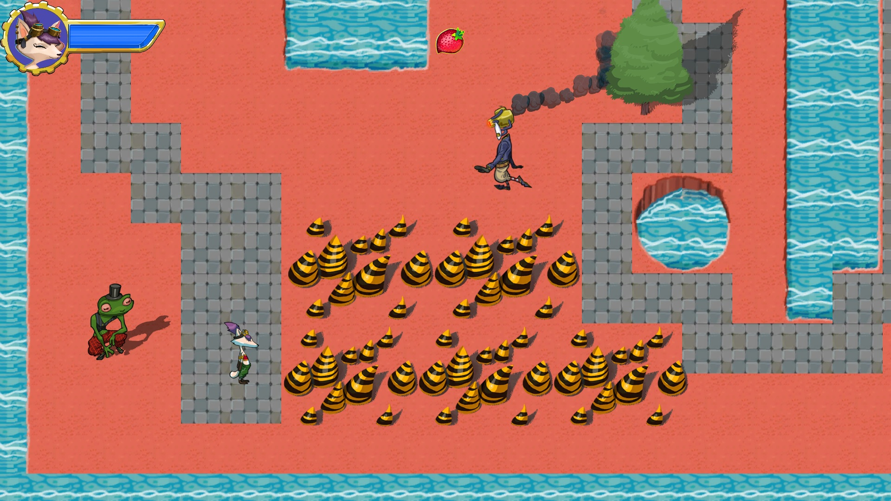
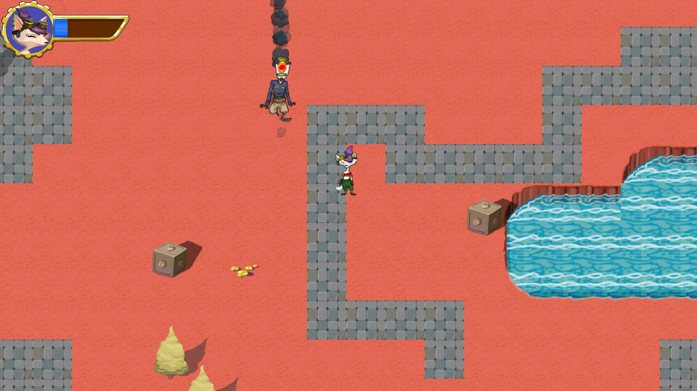
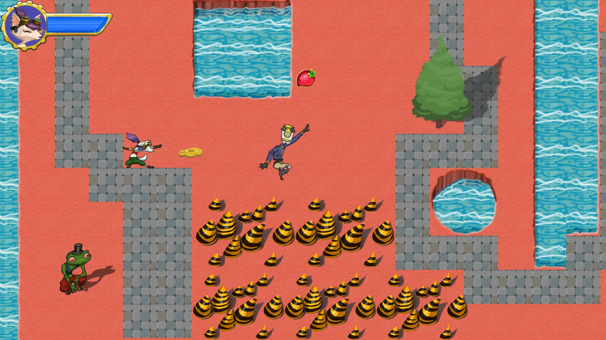

# Classic 2D RPG
The game is a 2D role-playing game which features Ruby, who's goal is to fix all the corrupted robots in the game environment. Press "x" to talk to the frog NPC at the start of the game. Press "c" to shoot a cog wheel at the corrupted robots and fix them! Beware of spikes and use strawberries to bring your health up. All aspects of the scripting was done by me. The game features the use of sprites and includes details such as particle effects, which can be seen from the smoke coming out of the robots for example. HUD elements are also added to give the player health information.

The guide that was followed to build this game can be found here: https://learn.unity.com/project/ruby-s-2d-rpg

# Playing the game
To play the game, copy the "Build" folder to your local directory and run the .exe file inside.

# Screenshots
Below are some screenshots of the game.

Gameplay
 

More gameplay

Cog launch

